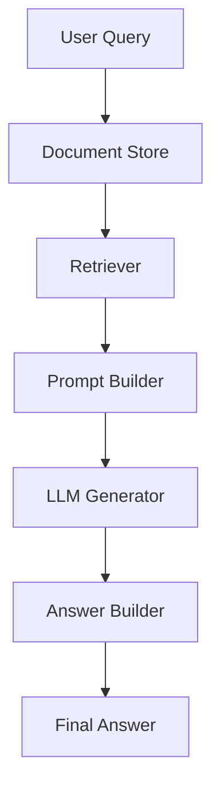
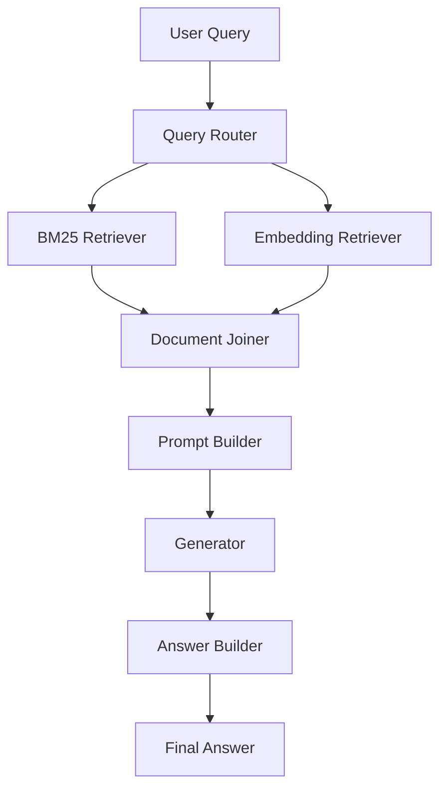
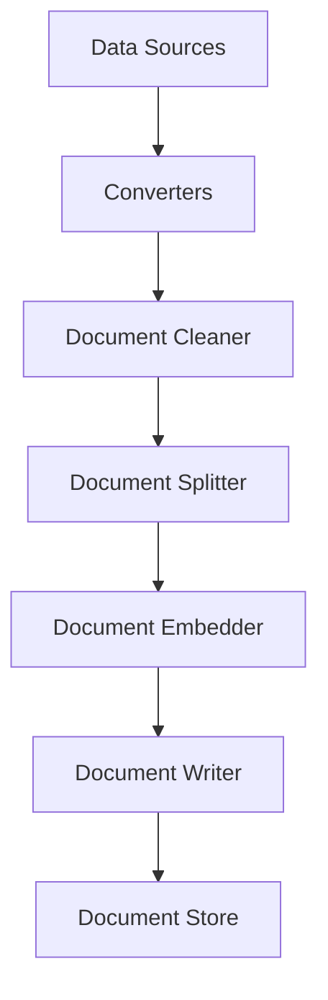
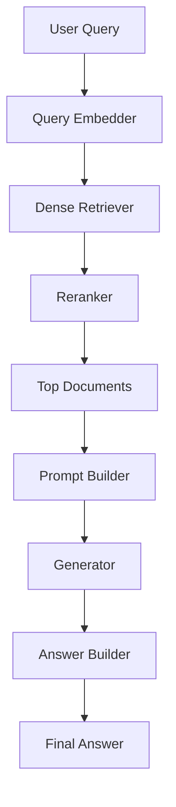

# Haystack Pipeline Architecture Reference

This document provides reference architectures for common Haystack pipelines. More detailed explanation for right usage of each component can be found in its respective component page under the section `Most common position in a pipeline`.

The goal is to show **where components are typically placed in a pipeline**.
These are conceptual layouts that help design consistent systems.
Feel free to edit based on the use-case and needs.

---

## 1. RAG Architecture

The most common Haystack architecture for question answering.

---

## 2. Hybrid Retrieval Architecture

Used when combining **keyword search + semantic search**.

---

# 3. Indexing Pipeline Architecture

This pipeline prepares documents before they are searchable.

---

# 4. Multi-Stage Retrieval Architecture (Advanced RAG)

Used for **high quality retrieval systems**.

---
